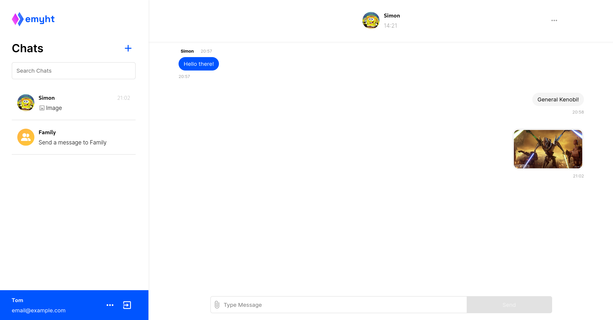
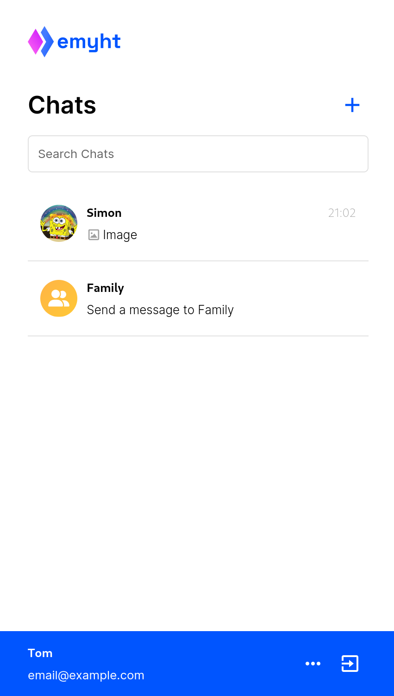

---

emyht is a chat app that lets you stay in touch with your friends, family and everyone thats important to you

[Try it out!](https://emyht.com)

## Tech used:

- Frontend
  - [TypeScript](https://github.com/microsoft/TypeScript)
  - [React](https://github.com/facebook/react)
  - [TanStack Query](https://github.com/TanStack/query)
  - [TanStack Router](https://github.com/TanStack/router)
  - [Native WebSockets](https://developer.mozilla.org/en-US/docs/Web/API/WebSocket?retiredLocale=de)
  - [Tailwind](https://github.com/tailwindlabs/tailwindcss)
  - [Vite](https://github.com/vitejs/vite)
- Backend
  - [Go](https://github.com/golang/go)
  - [Labstack Echo](https://github.com/labstack/echo)
  - [Gorilla WebSocket](https://github.com/gorilla/websocket)
  - [PostgreSQL](https://www.postgresql.org/)
  - [Redis](https://github.com/redis/redis)
  - [S3](https://aws.amazon.com/de/s3/)
  - [AWS SES](https://aws.amazon.com/de/ses/)

## Screenshots

### Desktop

### Mobile

|                      Overview                       |                      Chat View                       |
| :-------------------------------------------------: | :--------------------------------------------------: |
|  |  |
